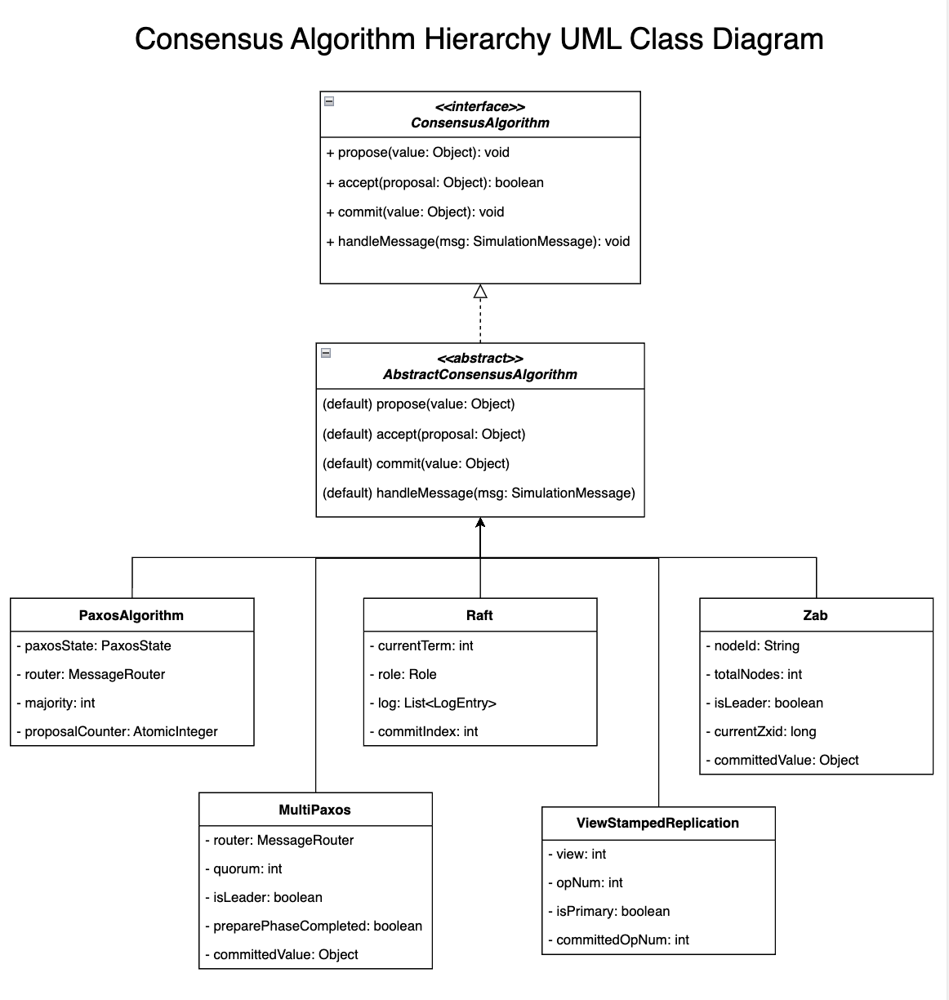
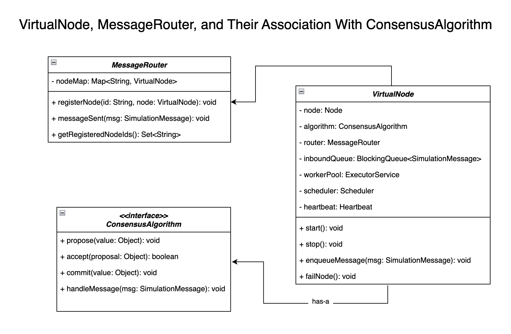

**CONSENSUS AND VIRTUAL NODE ARCHITECTURE**  
**Author:** Daniel Morales

---

## 1. Introduction

This document focuses on the **Consensus Algorithm Hierarchy** (Paxos, Raft, MultiPaxos, Zab, etc.) and how these algorithms integrate with the simulator's `VirtualNode` and `MessageRouter` components. It is intended to complement the broader _high-level-architecture.md_ document by providing more detailed UML class diagrams.

---

## 2. Consensus Algorithm Hierarchy UML Class Diagram

Below is a UML representation of the inheritance and implementation relationships among the various consensus classes:

**Key Points**
1. **ConsensusAlgorithm**
    - An interface declaring the primary methods: `propose`, `accept`, `commit`, and `handleMessage`.
2. **AbstractConsensusAlgorithm**
    - A base class providing default (often no-op) implementations of the `ConsensusAlgorithm` interface.
    - Concrete classes can extend this to avoid re-implementing common logic.
3. **Concrete Algorithms**
    - **PaxosAlgorithm** (basic Paxos)
    - **MultiPaxos** (an optimization of Paxos)
    - **Raft**
    - **Zab** (ZooKeeper Atomic Broadcast)
    - **ViewStampedReplication** (VSR)  
      Each implements protocol-specific state and message handling.

---

## 3. VirtualNode, MessageRouter, and Association with ConsensusAlgorithm

The second diagram highlights how `VirtualNode` uses the `ConsensusAlgorithm` and how messages are routed via the `MessageRouter`:

**Key Points**
1. **VirtualNode**
    - Simulates a single node in the system.
    - Holds a reference to a `ConsensusAlgorithm` instance (any of Paxos, Raft, etc.).
    - Enqueues incoming `SimulationMessage` objects, processes them, and may schedule tasks (e.g., heartbeats) via a `Scheduler`.
2. **MessageRouter**
    - A central routing component that stores references to each `VirtualNode` in a map.
    - Delivers messages from source node to target node (both are `VirtualNode`s).
    - Allows the simulator to intercept, log, or manipulate messages if needed (e.g., simulating delays).
3. **ConsensusAlgorithm**
    - An interface describing the contract for the various consensus protocols.
    - `VirtualNode` delegates all protocol-specific message handling to the algorithm’s `handleMessage`.

> **Current limitation (as of this writing):** `MessageRouter` delivers every message
> directly from source to target regardless of the simulation's chosen topology
> (RING/STAR/TREE/MESH). The neighbor map computed by `TopologyPlacer` is metadata for
> visualization only — it is not consulted by `MessageRouter` or by any consensus
> algorithm's broadcast logic, which always reaches every registered node. Quorum-based
> protocols need full connectivity to function at all, so this is a deliberate scope
> decision rather than a bug: enforcing topology-restricted delivery would require
> multi-hop message forwarding, which is not implemented. See `docs/README.md`'s "Known
> Limitations" section (to be added) for the full list.

> **Node recovery is protocol-specific, by design.** `VirtualNode.recoverNode()` (and
> the underlying `failNode()`/`recoverNode()` lifecycle) only restarts a node's message
> processing, phi-checker, and heartbeat — it does nothing to retroactively reconcile
> protocol state, because what "catching up" means differs by protocol:
> - **Raft**: nothing extra is needed. Once a recovered follower resumes processing
>   `APPEND_ENTRIES`, the leader's existing `nextIndexMap`/conflict-backoff logic in
>   `handleAppendEntriesResponse` walks it back into sync over the next propose-triggered
>   round trip(s) — the same mechanism that handles any follower falling behind, not
>   special-cased recovery logic. See `RaftRecoveryIntegrationTest` for a real,
>   non-mocked demonstration of a failed leader being replaced and the old leader
>   catching up after recovery.
> - **Paxos / Multi-Paxos / Zab / VSR**: there is no ordered log to catch up — a
>   recovered node simply rejoins and participates in future rounds. Retroactively
>   syncing whatever was decided while the node was down is explicitly out of scope.

---

## 4. Additional Notes

- **Extensibility**: Adding new consensus protocols involves creating a class that implements or extends the same `ConsensusAlgorithm` contract.
- **Simulation Behavior**: During runtime, each `VirtualNode` instance:
    1. Receives messages (proposals, heartbeats, requests) through the `MessageRouter`.
    2. Forwards consensus-specific traffic to the embedded `ConsensusAlgorithm`.
    3. Schedules tasks (e.g., timeouts, repeated heartbeats) via the shared `Scheduler`.

---

## 5. Conclusion

These diagrams illustrate the core simulation classes related to consensus. By decoupling `MessageRouter`, `VirtualNode`, and `ConsensusAlgorithm`, the DSS architecture allows different protocols to be easily swapped, tested, and monitored.

