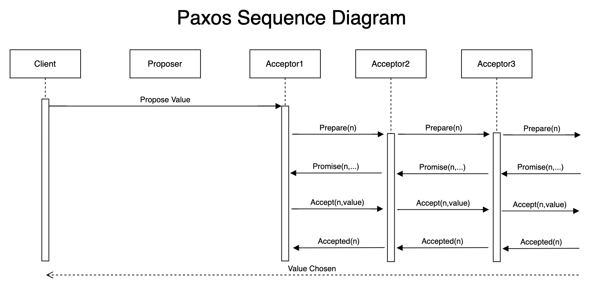
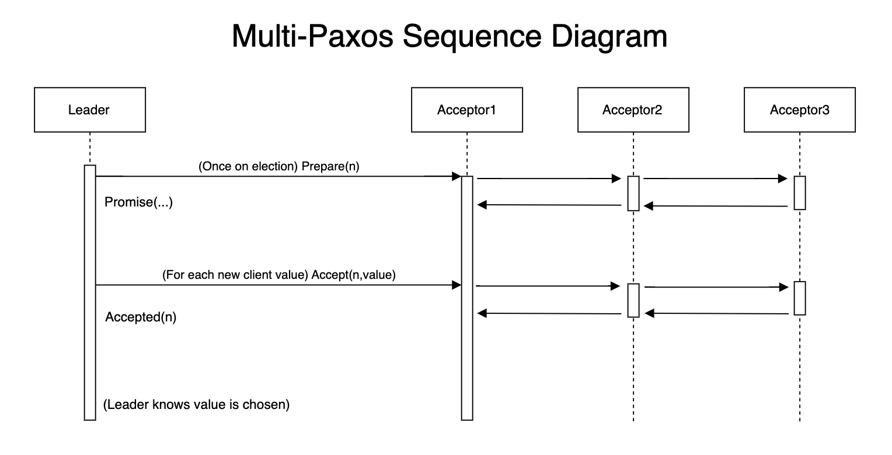
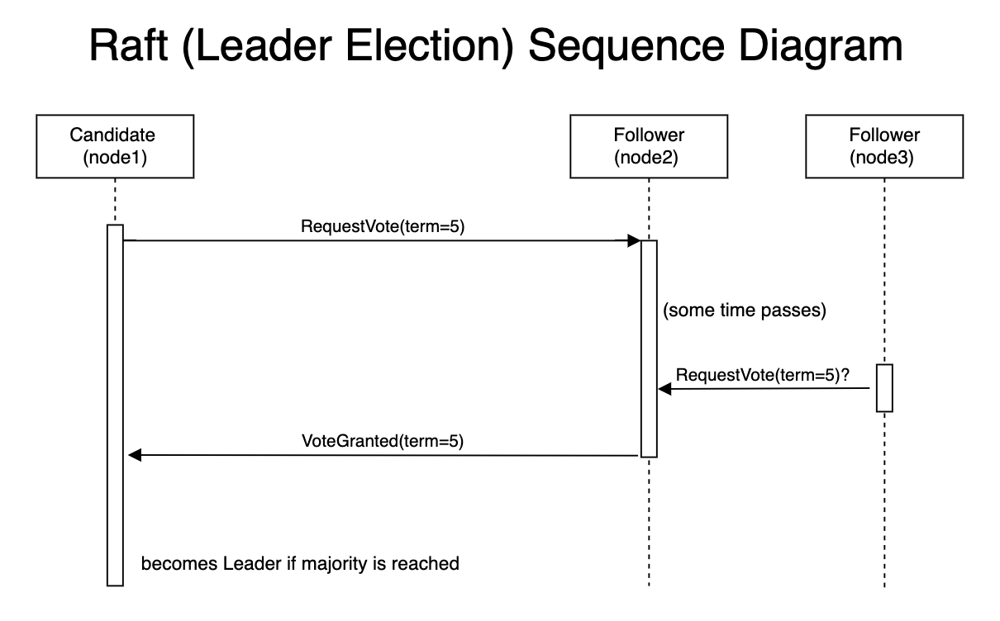
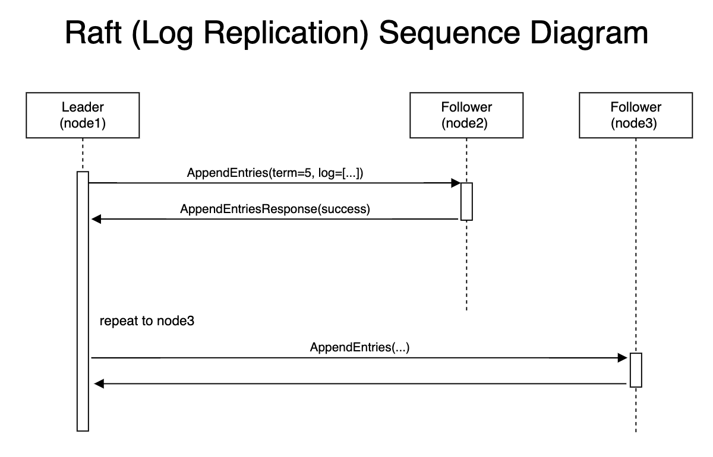

**CONSENSUS SEQUENCE DIAGRAMS**  
**Author:** Daniel Morales

---

## 1. Introduction

This document provides a detailed walkthrough of the message flows for the various consensus protocols implemented in the simulator. The sequence diagrams below illustrate the step‑by‑step interactions between key components (e.g. Proposer/Leader, Acceptor/Replica, and Learner) during the normal (successful) case of consensus. These diagrams complement the architectural overview provided in the _consensus-architecture.md_ document and help clarify the temporal flow and decision-making processes within each protocol.

---

## 2. Basic Paxos Sequence Diagram

**Key Points:**
- A client submits a proposal to a **Proposer**.
- The Proposer broadcasts a **PREPARE** message to the **Acceptors**.
- Acceptors respond with **PROMISE** messages, pledging not to accept proposals with lower numbers.
- The Proposer then sends an **ACCEPT** request with the chosen value.
- Acceptors reply with **ACCEPTED** messages when they accept the proposal.
- Once a majority of Acceptors have replied, the value is considered chosen.

---

## 3. Multi-Paxos Sequence Diagram

**Key Points:**
- On leader election, the newly elected leader performs a one‑time **PREPARE** phase.
- For each subsequent client command, the leader directly issues **ACCEPT** requests.
- Acceptors respond with **ACCEPTED** messages.
- The leader commits a value after receiving a quorum of ACCEPTED responses.
- This optimization minimizes the overhead of repeated prepare phases for successive proposals.

---

## 4. Raft Sequence Diagrams

### 4.1 Raft Leader Election Sequence Diagram

**Key Points:**
- A node transitions to a **Candidate** and sends **REQUEST_VOTE** messages to all other nodes.
- Peers respond with **REQUEST_VOTE_RESPONSE** messages.
- If the candidate receives a majority of votes, it becomes the **Leader**.

### 4.2 Raft Log Replication Sequence Diagram

**Key Points:**
- The **Leader** appends a new command to its log.
- It sends **APPEND_ENTRIES** messages (which may serve as heartbeats or contain new log entries) to the **Followers**.
- Followers validate log consistency and reply with **APPEND_ENTRIES_RESPONSE** messages.
- Once a quorum of Followers acknowledges the new entry, the Leader commits it and applies the command.
- The Leader then notifies all Followers that the entry has been committed.

---

## 5. Additional Notes

- **Focus on Normal Operation:** These diagrams depict the normal, successful flow of each protocol. They do not illustrate edge cases such as timeouts, leader or network failures, or retries.
- **Abstraction Level:** The diagrams abstract away lower-level network and concurrency details to emphasize the protocol’s core message exchanges.
- **Integration with Simulator Components:** The flows mirror the interactions between components such as the VirtualNode and MessageRouter in the simulator.

---

## 8. Conclusion

The sequence diagrams provided in this document offer a clear visualization of how distributed consensus is achieved using various protocols. They serve as a practical guide to understanding the order and nature of message exchanges that underpin the consensus algorithms implemented in the simulator.

