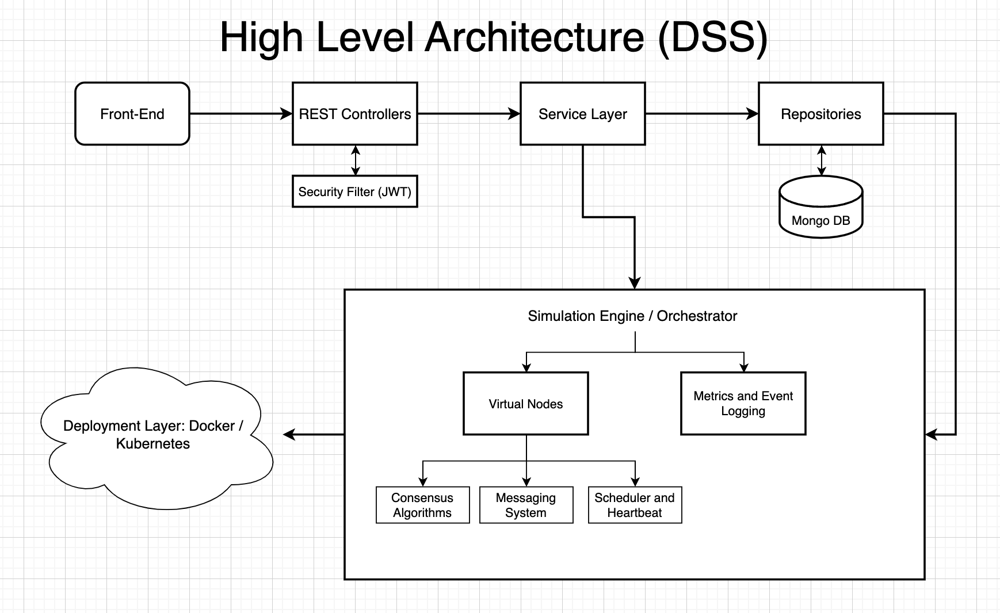

**DISTRIBUTED SYSTEMS SIMULATOR (DSS)**  
**High-Level Architecture**  
**Author:** Daniel Morales

---

### 1. Introduction

This document provides a high-level overview of the architecture of the **Distributed Systems Simulator (DSS)**. The DSS is designed to model and experiment with various consensus algorithms (Paxos, Multi-Paxos, Raft, ZAB, and View-Stamped Replication) in a simulated environment, while providing real-time metrics, logging, and flexible deployment options.

The codebase is structured into a **backend**, **frontend**, **database**, and **deployment** layers, reflecting a typical multi-tier application. This report highlights each major component, referencing the diagram below to illustrate the overall architecture.

---

### 2. High-Level Architecture Diagram

Below is the diagram representing the high-level architecture of DSS:



---

### 3. Overview of Each Layer

1. **Front-End**  
   - **Purpose**: A user interface (UI) that communicates with the backend via REST APIs and WebSockets.  
   - **Technologies**: Built with React.  
   - **Responsibilities**:  
     - Displays real-time simulation metrics.  
     - Allows users to configure, start, and stop simulations.  
     - Subscribes to WebSocket channels to receive events and metrics updates.

2. **REST Controllers (Backend)**  
   - **Purpose**: Expose endpoints for managing simulations, nodes, algorithms, and topologies.  
   - **Components**:  
     - **AlgorithmController**: Retrieves available consensus algorithms (e.g., Paxos, Raft).  
     - **NodeController**: Manages nodes (create, delete, query).  
     - **SimulationController**: Handles the lifecycle of a simulation (start, stop, fail nodes).  
     - **TopologyController**: Manages network topologies (e.g., ring, mesh).  
   - **Security Filter (JWT)**:  
     - Intercepts requests and checks for valid JWT tokens if security is enabled.  
     - Can be disabled for local development.

3. **Service Layer**  
   - **Purpose**: Encapsulate business logic for nodes, simulations, and algorithms.  
   - **Examples**:  
     - **NodeService**: Fetches/stores node data and ensures correct transitions (ACTIVE, FAILED).  
     - **SimulationService**: Coordinates the entire simulation lifecycle, integrates with the orchestrator, manages events, and updates statuses.  
     - **AlgorithmService**: Lists supported consensus algorithms.

4. **Repositories**  
   - **Purpose**: Abstract database operations, with Spring Data MongoDB.  
   - **Examples**:  
     - **NodeRepository**: CRUD for node documents.  
     - **SimulationRepository**: CRUD for simulation documents.  
     - **NetworkTopologyRepository**: Manages topology definitions.  
   - **MongoDB** is the primary data store.

5. **Simulation Engine / Orchestrator**  
   - **Purpose**: The core of the simulator, coordinating distributed consensus across virtual nodes.  
   - **Key Sub-Components**:  
     1. **Virtual Nodes**: Each node is simulated as a `VirtualNode` object, running a chosen consensus algorithm (Paxos, Raft, etc.).  
     2. **Messaging System**: Routes messages (e.g., heartbeats, proposals) between nodes via a `MessageRouter`.  
     3. **Scheduler & Heartbeat**: Manages time-based tasks (heartbeats, timeouts, etc.) with a configurable thread pool.  
     4. **Consensus Algorithms**: Modular code for Paxos, Multi-Paxos, Raft, ZAB, and VSR.  
     5. **Metrics & Event Logging**: Collects performance data (throughput, latency) and logs events (node failures, commits, etc.). These updates are sent to the front-end in real time via WebSockets.

6. **Deployment Layer**  
   - **Docker / Kubernetes**:  
     - **Docker Compose** for local multi-container setups (frontend, backend, MongoDB).  
     - **Kubernetes** manifests (`deployment.yaml`, `service.yaml`) for production or cloud deployments.  
   - **Responsibility**: Simplify running the simulator across multiple environments, scaling the backend, and managing the database container.

---

### 4. Key Architecture Highlights

- **Security**: Optional JWT-based authentication/authorization. Can be disabled for local demos.  
- **Consensus Algorithms**: Cleanly separated into packages (`paxos`, `raft`, `multi_paxos`, `zab`, `view_stamped_replication`), each implementing a common interface (`ConsensusAlgorithm`).  
- **Messaging Abstraction**: The `MessageRouter` decouples node-to-node communication, enabling easy simulation of network partitions or message delays if needed.  
- **Metrics & Logging**: Real-time metric snapshots are broadcast to the front-end, and each node logs events (commits, proposals, failures).  
- **Scalability**: Docker and Kubernetes support allow easy scaling of the simulator or integration into CI/CD pipelines.

---

### 5. Codebase Structure

Below is a simplified view of the code layout:

```plaintext
├── backend
│   ├── src/main/java/com/dss/backend
│   │   ├── config          // Spring Boot configs, JWT filter, properties
│   │   ├── consensus       // Paxos, Raft, Zab, VSR, etc.
│   │   ├── controller      // REST controllers
│   │   ├── dto             // Data Transfer Objects
│   │   ├── engine          // Simulation engine, scheduling
│   │   ├── messaging       // MessageRouter, VirtualNode
│   │   ├── metrics         // Metric collectors, snapshots
│   │   ├── model           // Domain models (Node, Simulation, etc.)
│   │   ├── repository      // Spring Data MongoDB repositories
│   │   ├── security        // JWT security
│   │   └── service         // Business logic
│   └── pom.xml
├── frontend
│   └── (React-based UI)
├── database
│   └── init.sql
├── deployment
│   ├── docker-compose.yml
│   └── kubernetes
│       ├── deployment.yaml
│       └── service.yaml
└── docs
    └── (Documentation)
```

---

### 6. Conclusion

The **Distributed Systems Simulator (DSS)** is a comprehensive framework for experimenting with consensus protocols in a simulated environment. By separating concerns across the front-end, REST controllers, service layer, repository layer, and the core simulation engine, DSS remains flexible and extensible. Real-time metrics and event logging further enhance the user’s ability to observe distributed protocols under different scenarios.
