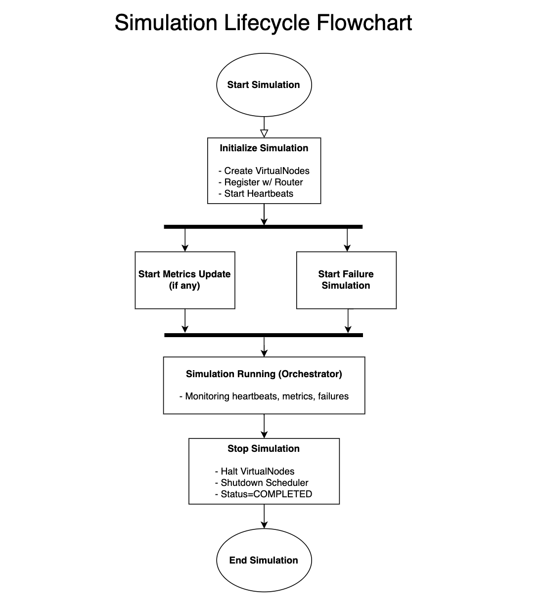

**SIMULATION LIFECYCLE**  
**Author:** Daniel Morales

---

## 1. Introduction

This document provides a high-level overview of the **Simulation Lifecycle** from start to end. It illustrates how the simulator initializes nodes, schedules recurring tasks (metrics, failure simulation), runs the orchestrator, and finally stops the simulation. The flowchart clarifies the order in which core actions (e.g., creating `VirtualNode` instances, starting heartbeats, collecting metrics) are performed, as well as how the simulator transitions to a completed state.

---

## 2. Lifecycle Diagram

Below is the diagram representing the lifecycle of a simulation:

**Key Points:**

1. **Start Simulation**  
   The user (or system) triggers the simulation to begin. This is often a REST call.

2. **Initialize Simulation**
    - **Create VirtualNodes:** For each configured node, a `VirtualNode` is instantiated with the chosen consensus algorithm.
    - **Register w/ Router:** Each node is registered with a central `MessageRouter` so messages can be delivered.
    - **Start Heartbeats:** A heartbeat mechanism (e.g., a scheduled task) is launched for each node.

3. **Start Metrics Update (If Any)**
    - The simulator may schedule periodic metrics collection. These metrics (latency, throughput, etc.) are either stored or sent to a front-end.

4. **Start Failure Simulation (Optional)**
    - If configured, a failure simulation task is scheduled. It may randomly fail nodes or simulate network issues.
    - This runs in parallel with the metrics updates (the flow eventually joins back into the main “Simulation Running” state).

5. **Simulation Running (Orchestrator)**
    - A central **Orchestrator** monitors node heartbeats, metrics, and potential node failures.
    - The orchestrator also manages the entire lifecycle (start/stop signals, event logging, etc.).

6. **Stop Simulation**
    - **Halt VirtualNodes:** Each `VirtualNode` is stopped, terminating heartbeats and message processing.
    - **Shutdown Scheduler:** Any scheduled tasks (metrics updates, failure injection) are canceled.
    - **Status = COMPLETED:** The simulator’s status is set to `COMPLETED`, signaling that the run has finished.

7. **End Simulation**  
   The simulation fully terminates, releasing resources (thread pools, memory structures). At this point, no further tasks are active.

---

## 3. Detailed Steps

1. **Start Simulation**  
   A user or automated script initiates the simulation. In code, this often corresponds to a method like `runSimulation(simulationId)` which sets the state to `RUNNING`.

2. **Initialize Simulation**
    - **Create VirtualNodes**: The system reads the simulation configuration (number of nodes, consensus algorithm) and spawns `VirtualNode` objects.
    - **Register w/ Router**: Each node is added to the shared `MessageRouter`, ensuring that messages (e.g., Paxos proposals, Raft heartbeats) can be routed.
    - **Start Heartbeats**: A heartbeat service (using a `Scheduler`) begins sending periodic heartbeat messages to detect failures.

3. **Start Metrics Update**  
   If metrics are enabled, the simulator sets up a recurring task (e.g., every 5 seconds) to gather data on message counts, latencies, proposals, commits, etc. These snapshots may be sent to a front-end UI or stored for analysis.

4. **Start Failure Simulation**
    - A separate scheduled task may inject failures (e.g., random node crashes) at intervals or percentages.
    - Both metrics updates and failure simulation can run concurrently with the main simulation.

5. **Simulation Running (Orchestrator)**
    - An **Orchestrator** component supervises the simulation, coordinating tasks, logging events, and handling external requests (like failing a specific node).
    - It checks heartbeats, updates metrics, and ensures the system transitions correctly between states (running → stopping → completed).

6. **Stop Simulation**
    - The user (or system) issues a stop command, prompting the orchestrator to halt all nodes and tasks.
    - Heartbeats, metrics, and failure injection tasks are canceled.
    - The simulation status is updated to `COMPLETED` in the database or in-memory structures.

7. **End Simulation**  
   All resources (thread pools, data structures) are freed or shut down. No further tasks remain active, and the simulation is considered finished.

---

## 4. Additional Notes

- **Parallel Tasks**: Metrics collection and failure simulation are typically scheduled in parallel, meaning they run independently but feed back into the same orchestrator for logging and status updates.
- **Configurable Scheduling**: The intervals for heartbeats, metrics, and failures can be tuned in `application.properties` or through environment variables (e.g., `simulation.heartbeatIntervalMillis`).

---

## 5. Conclusion

The **Simulation Lifecycle Flowchart** offers a concise roadmap for how the simulator transitions from initialization to a fully running state, and eventually to a complete stop. By breaking down each phase (initialize nodes, start tasks, run orchestrator, stop tasks), developers and users gain clarity on where custom logic, such as metrics plugins or advanced failure modes can be inserted. This lifecycle forms the backbone of orchestrating distributed protocol simulations in the **Distributed Systems Simulator**.
