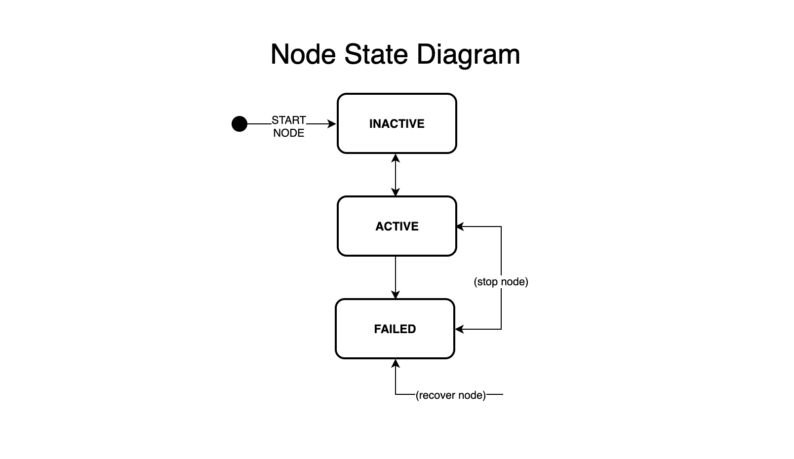
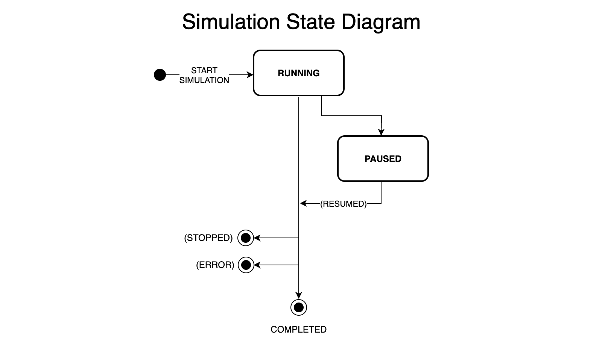

**SIMULATION / NODE-STATE**  
**Author:** Daniel Morales

---

## 1. Introduction

This document provides an overview of two related diagrams that describe:
1. The **Node State Diagram** (how an individual node transitions among `INACTIVE`, `ACTIVE`, and `FAILED` states).
2. The **Simulation State Diagram** (how the simulation as a whole moves from start to running, paused, or completed).

These diagrams complement each other, showing both the per-node lifecycle and the broader simulation lifecycle.

---

## 2. Node State Diagram

Below is the diagram representing the lifecycle of a single node:

**Key Points:**

1. **INACTIVE**
    - A node starts in the `INACTIVE` state when it is initialized but not yet running.
    - Transition **(start node)** moves it to `ACTIVE`.

2. **ACTIVE**
    - The node is running normally—sending/receiving messages, participating in consensus, etc.
    - From `ACTIVE`, if a fail event occurs (e.g., crash, or induced failure in the simulation), the node transitions to `FAILED`.
    - Alternatively, a user or orchestrator can “stop” the node, which typically moves it back to `INACTIVE`. 

3. **FAILED**
    - The node has crashed or is otherwise non-functional.
    - Transition **(recover node)** brings it back to `ACTIVE`—representing a restart or a repair that makes the node operational again.

---

## 3. Simulation State Diagram

Below is the diagram showing how the simulation itself transitions through high-level states:

**Key Points:**

1. **Start Simulation**
    - The simulation begins in a “start” event, which initializes all nodes (possibly in `INACTIVE` state), sets up the scheduler, and moves to `RUNNING`.

2. **RUNNING**
    - While running, all nodes can be started (moved to `ACTIVE`) and actively participate in the consensus protocol.
    - At any time, a “pause” action can move the simulation to the `PAUSED` state, suspending node processing or message flow.

3. **PAUSED**
    - The simulation is temporarily halted. No further progress occurs until it is resumed.
    - A “resumed” action returns it to the `RUNNING` state.

4. **COMPLETED**
    - The simulation ends if it is **stopped** intentionally (e.g., user requests it) or if a critical **error** occurs.
    - Once `COMPLETED`, the simulation releases resources. No further actions are processed.

---

## 4. Conclusion

- **Node State Diagram** focuses on a single node’s life: from `INACTIVE` → `ACTIVE` → `FAILED`, with possible recovery or stops in between.
- **Simulation State Diagram** captures the overarching states of the entire simulation run: from `RUNNING` and `PAUSED` to `COMPLETED`.